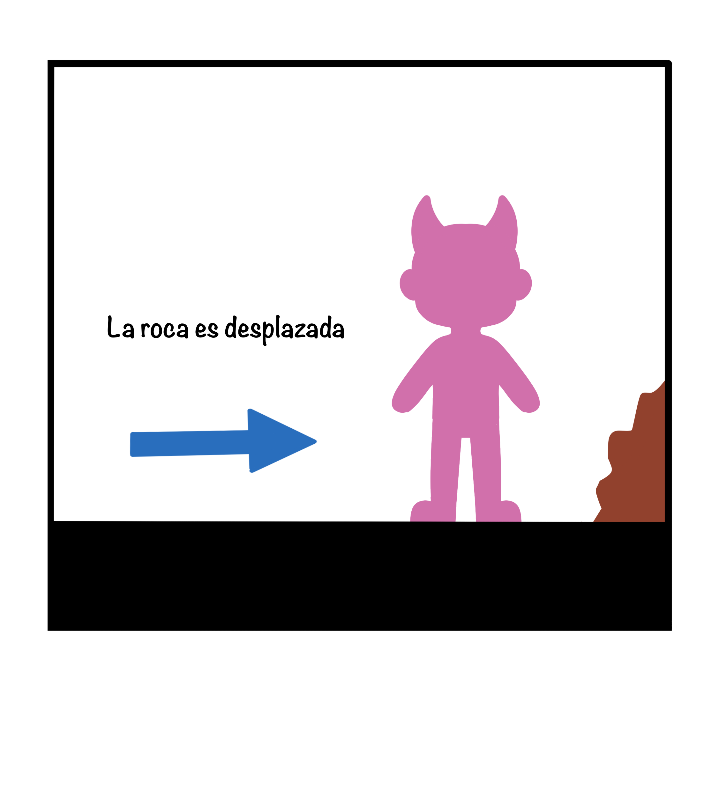
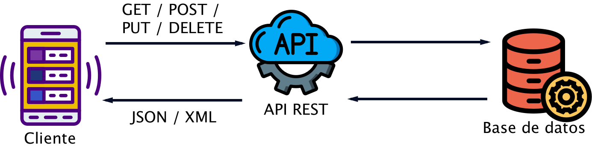

# Caída Celestial: El Desafío de los Exiliados
## Documento de diseño  

### *Diseño y Desarrollo de Videojuegos (Quintana 2023-2024) Juegos en Red* 

**Integrantes** 

*Irene Rodríguez García*
*Miriam Sanz Tardón*
*Cristina Valero Abella* 
*Rosa Ghaudy Bellido Euribe* 

**McAcos** 

## ***Índice***

**1 Introducción** 

1. Concepto del Juego 
1. Características Principales 
1. Género 
1. Propósito y Público Objetivo 
1. Estilo Visual 
1. Modelo de negocio y Plataformas 

**2 Guion**  

1. Historia principal 
1. Presentación de los personajes 
1. Presentación del mundo 
1. Final(es) 

**3 Mecánicas de Juego** 

1. Personajes
1. Movimiento  

3\.2.1 Controles

3. Locaciones 
3. Objetos, elementos interactuables

**4 Interfaz** 

1. Diagrama de Flujo 
1. Menú Principal 
1. Menú de Opciones  
1. Pantalla de Juego 
1. Fin de Nivel 
1. Créditos  

**5 Audio** 

1. Música  
1. Voces 
1. Efectos de Sonido 

**6 Bibliografía** 

## ***1. Introducción*** 

Se presenta el documento de desarrollo del videojuego Caída Celestial: el desafío de los exiliados. Este GDD forma parte de la Fase 2 (Equipo de Desarrollo y Temática del Juego) de la práctica de la asignatura de Juegos en Red.

El objetivo de la anterior fase era formar el equipo de desarrollo, elegir la temática del juego e identificar sus funcionalidades y mecánicas principales, en esta nueva fase se pide implementarlo en javascript con el framework de Phaser 3 y que los jugadores puedan jugar por via local únicamente. Esta fase será la base para la siguiente fase.

El equipo de desarrollo está formado por Irene Rodríguez García, Miriam Sanz Tardón, Cristina Valero Abella y Rosa Ghaudy Bellido Euribe; el nombre que se le ha dado a dicho equipo es “McAcos”.

El concepto del equipo está basado en los macacos, los animales más inteligentes de la selva, que con gran adaptabilidad y destreza trepan lianas y árboles estratégicamente, del mismo modo en el que nosotras inesperadamente dominamos el mercado, con una popularidad exponencialmente creciente que se eleva por encima de la competencia rápidamente. Imparables, graciosos, con un ingenio incansable y un encanto que no pasa de moda, demostrando tenacidad que no se rinde acompañada de frescas ideas y siempre dispuestos a darlo todo para conseguir lo que quieren, son la mejor representación del espíritu e ideales del equipo dedicado y trabajador.

` `*Img. Logo del equipo de Desarrollo “McAcos”* 

Toda  la  información  correspondiente  al  Game  Design  Document  se  encuentra  descrita  a continuación. Asimismo, este documento cuenta con recursos audiovisuales con el objetivo de ilustrar los elementos del videojuego a desarrollar. 

1. ***Concepto del Juego*** 

Se trata de un juego cooperativo para dos jugadores. Se toma el control de dos Ángeles que se encuentran en el subsuelo y deben regresar al cielo, colaborando entre ellos para lograr dicho objetivo. Durante el trayecto se enfrentarán a  una serie de puzles, los cuales podrán ser resueltos mediante el uso de sus habilidades e ingenio. El juego consta de varios finales, dependiendo de las acciones que decidan tomar los jugadores; el conseguir entrar al cielo está en sus manos. 

2. ***Características principales*** 

El juego se caracteriza por una temática fantástica y un estilo visual lindo y amigable que esconde  una  trama  algo  más  oscura.  El  escenario  está  conformado  por  plataformas  y  el gameplay se basa en la resolución de diversos puzzles en los cuales ambos jugadores alterarán el entorno que los rodea mediante múltiples mecanismos que deberán comprender y dominar para despejar el camino ascendente hasta la cima de vuelta al cielo del que fueron desterrados. Lo más destacable son las mecánicas que requieran una buena compenetración y el trabajo en equipo que estas requieren en correlación con la historia y la moraleja que transmite. 

***1.3. Género*** 

Este juego se clasifica como un juego multijugador cooperativo de plataformas de carácter competitivo. El número de jugadores siempre es dos y cada uno maneja un personaje principal con sus atributos y habilidades características únicas. A pesar de demandar un gameplay cooperativo durante la primera y principal parte de mayor duración, este revela finalmente un carácter competitivo en una última carrera hacia la puerta del cielo que dará pie a diversos finales. 

4. ***Propósito y público objetivo*** 

El público objetivo de este juego son los jugadores casuales, concretamente jóvenes y adultos que busquen una divertida distracción de sus ajetreadas vidas cotidianas. Con el propósito de entretener a dichos jugadores se plantea una experiencia amena y sencilla de comprender con un trasfondo y un estilo visual que capte y retenga la atención del jugador más allá de un simple viaje entre plataformas sin sentido, aunque sin requerir una concentración extrema en instantes precisos. Por este motivo la clasificación PEGI (Pan European Game Information) por edades para este producto es apto para jugadores mayores a los siete años. 

5. ***Estilo visual*** 

Se trata de un juego con estilo Cartoon 2D. Es decir, se busca un estilo más infantil y poco realista. Exagerando y minimizando rasgos de los elementos en cuestión. Los personajes y escenarios serán simples y caricaturescos para una mayor sencillez y accesibilidad. 

El  videojuego  será  en  2D,  es  decir  se  utilizarán  únicamente  dos  dimensiones  para  la representación del mundo y su contenido. Se busca una experiencia basada en el scroll lateral, donde los jugadores solo podrán moverse sobre los ejes X e Y. 

6. ***Modelo de Negocio y Plataformas*** 

Caída Celestial será un juego gratuito sin ánimo de lucro; sin embargo podría llegar estar abierto  a  posibles  donaciones  en  el  futuro.  Será  distribuido  digitalmente  empleando plataformas como GitHub. 

En cuanto a los costes, al ser un juego no lucrativo el mayor coste va a ser el tiempo que se le dedica en el desarrollo. Todos los assets y código serán de creación propia por lo que no será necesario pagar a ningún colaborador externo. El equipo desarrollador cuenta con el material imprescindible para el correcto desarrollo, por lo que tampoco habrá que comprar ningún dispositivo u accesorio. 

En cuanto la propuesta de valor,se ofrece un juego  cooperativo de plataformas que permite una conexión con los dos jugadores además de una experiencia única de resolver problemas del mundo con el otro jugador. El trato con los clientes será cercano mediante el uso de redes sociales. 

En cuanto a los recursos y actividades clave; son necesarios dos jugadores y dos ordenadores para poder disfrutar de la experiencia. Como ya acaba de ser mencionado, la plataforma para la que se encontrará disponible será el ordenador. Los jugadores interactúan con el mundo y sus personajes mediante el uso de teclado y ratón. Todos estos controles y formas de interacción serán explicados en detalle más adelante. 

*Img. Modelo de Negocio* 

## ***2 Guion*** 

A continuación se presenta la historia del videojuego y todos sus finales alternativos. Asimismo se presentarán y describirán los personajes y el mundo en el que se encuentran. 

1. ***Historia Principal*** 

***(Guion de la historia sujeta a futuros posibles cambios)*** 

El subsuelo, un lugar temido por los ángeles, guardianes de Dios, debido a su esencia oscura y a los rumores que corren sobre que es un lugar gobernado por el mal. Durante muchos años hubo un solo habitante en este lugar, Cassadie, el cual, a pesar de las fuertes alucinaciones y torturas a las que le sometía el dios de mal pudo mantener una pizca de bondad y del bien en su corazón para no caer del todo al infierno y perderse completamente a sí mismo. Se puede observar el fruto de las acciones del dios del mal en el aspecto del pequeño ángel caído y también en su mentalidad y forma de comportarse.  

-Traicionaste a tu creador…. -Sonaban constantemente voces en su cabeza.- Jamás volverás a obtener el amor de tu Dios. 

En ese espacio solo se podían escuchar los gritos de desesperación de Cassadie. Entre el constante ruido se comienzan a escuchar unos ligeros pasos, estos pertenecían a Seraphina, otro pequeño ángel que Dios había expulsado. Al verlo las alucinaciones y las voces cesaron y su mirada se clavó en la silueta que se estaba acercando poco a poco hacia él.  

-¿Otro ángel caído?- Pensó Cassadie -Es mi billete para salir de aquí.- Una ligera sonrisa se formó en sus labios. 

-¿Tu Dios te ha abandonado aquí? -Preguntó Cassadie acercándose al nuevo habitante del subsuelo. 

-¿Qué es este lugar? -La voz de Seraphina sonaba temblorosa al formular esa pregunta. 

-Tu nuevo hogar.- Respondió secamente. 

Tras escuchar esa respuesta se podía observar como un gran miedo y una gran ansiedad invadía el cuerpo del nuevo ángel caído. Se podía ver como Cassadie disfrutaba de ver las reacciones del recién llegado, hacía mucho tiempo que no interactuaba con alguien que no fueran sus propias voces. 

-¿Quieres regresar al cielo verdad?- Cassadie quería aprovechar esta nueva oportunidad para salir de ese lugar, ya que a pesar, de haber intentado escapar de allí múltiples veces, siempre fallaba.- Por nuestra cuenta jamás podremos volver al cielo, pero si trabajamos juntos seremos capaces.- Agarró por los hombros ligeramente fuerte al Seraphina y mientras hablaba podía notarse la desesperación que tenía por salir de allí.  

A pesar de que Cassadie no le daba nada de confianza decide cooperar con él, pues quedarse allí era una decisión mucho peor. 

-Trabajemos juntos para regresar.- Afirmó Seraphina. 

Tras esto se da comienzo al juego, donde los jugadores deberán cooperar para poder avanzar. Tras superar los diferentes escenarios, los ángeles caídos logran llegar al cielo. Sin embargo, solo el primero en llegar logra acercarse a las puertas del cielo, donde está esperando Dios, como si estuviera esperando la llegada de uno de los dos. 

“RAMIFICACIÓN DE LOS FINALES” 

“PRIMER FINAL. EL PRIMERO EN LLEGAR ES CASSADIE.” 

-Te estaba esperando, has logrado regresar aquí, sin embargo, antes de dejarte pasar por estas puertas debes tomar una decisión.- Dijo Dios con voz firme.- ¿Deseas regresar tú solo o deseas que tu compañero y tú podáis regresar?. 

Dentro  del  propio  juego  se  muestran  dos  opciones  para  que  el  jugador  correspondiente seleccione su elección. Regresar él solo o regresar ambos. 

“RAMIFICACIÓN” 

“PRIMERA OPCIÓN. SE DECIDE REGRESAR SOLO.” 

Dios mira a Cassadie con una cara de molestia y cierto enfado, sin embargo esto no puede observarse ya que, antes ellos, se presenta como una simple luz. -Tu corazón ya no puede albergar bondad. -A pesar del tono frío y duro con el que habla Dios se puede notar una ligera tristeza. -Me has decepcionado. Tus actos te condenarán a ti y a tu compañero al sufrimiento eterno.  

Tras estas palabras Dios envía directamente a Cassadie al infierno, pues ya es apto para estar allí de por vida y Seraphina es enviado de nuevo al subsuelo. 

“SEGUNDA OPCIÓN. SE DECIDE REGRESAR AMBOS.” 

Dios mira a Cassadie con una cara de orgullo, sin embargo esto no puede observarse ya que, antes ellos, se presenta como una simple luz. -El hecho de que hayas cooperado con un compañero y que hayas elegido que podáis regresar los dos a pesar de haber llegado tu primero demuestra que sigue habiendo bondad en tu corazón y que eres capaz de cambiar. Os daré otra oportunidad. -Su voz era dulce y cálida, orgulloso y feliz de poder dar de nuevo la bienvenida a sus queridos ángeles. 

Tras esto las puertas del cielo se abren y ambos son capaces de volver a entrar y regresar a ser ángeles. 

“SEGUNDO FINAL. EL PRIMERO EN LLEGAR ES SERAPHINA.” 

-Te estaba esperando, has logrado regresar aquí, sin embargo, antes de dejarte pasar por estas puertas debes tomar una decisión.- Dijo Dios con voz firme.- ¿Deseas regresar tú solo o deseas que tu compañero y tú podáis regresar?. 

Dentro del  propio juego  se muestran  dos opciones  para que  el jugador  correspondiente seleccione su elección. Regresar él solo o regresar ambos. 

“RAMIFICACIÓN” 

“PRIMERA OPCIÓN. SE DECIDE REGRESAR SOLO.” 

Dios mira a Seraphina con una cara que expresa tristeza, sin embargo, esto no puede observarse ya que, antes ellos, se presenta como una simple luz. -A pesar de que tu pecado no fue tan grande, te has vuelto una persona egoísta. -El tono con el que habla Dios transmite una profunda tristeza y decepción. -Me has decepcionado. Esperaba más de ti. Tus actos te condenarán a ti y a tu compañero para siempre. Tras estas palabras Dios envía a ambos de nuevo al subsuelo. 

“SEGUNDA OPCIÓN. SE DECIDE REGRESAR AMBOS.” 

Dios mira a Seraphina con una cara de orgullo, sin embargo esto no puede observarse ya que, antes ellos, se presenta como una simple luz. -Sabía que a pesar de tus pecados seguías siendo una buena persona y que tu corazón podía ser puro. Gracias a tu sabía elección le has otorgado a tu compañero una oportunidad de expiar sus pecados. Enhorabuena, podéis pasar -Su voz era dulce y cálida, orgulloso y feliz de poder dar de nuevo la bienvenida a sus queridos ángeles. Tras esto las puertas del cielo se abren y ambos son capaces de volver a entrar y regresar a ser ángeles. 

Se mostrará una pequeña ilustración correspondiente a cada final.

Tomando como base este guión/historia se pasó a escribir una pequeña introducción de la historia al principio del juego. Esta introducción es:
-'Tras años de torturas por parte del dios del mal, Cassadie por fin se encontraría con Seraphina. Otro ángel caído abandonado en el subsuelo... Quizá tenían más en común de lo que parecía. Y quizá no, quizás eso sería incluso mejor... Quizá podía ser su billete de vuelta.'

En cada final se muestra un dialógo diferente en función de lo que se haya escogido, también se basó en la historia completa escrita anteriormente, sin embargo, el dialogo es el mismo en cada tipo de final, es decir, que no varía en función de que personaje llegue primero.

El final en el que se escoge entrar solo el personaje que ha llegado primero es el siguiente:
-'-Te has vuelto egoísta. 
-Me has decepcionado. 
-Tus actos te condenarán a ti y a tu compañero al sufrimiento eterno. 
Y con eso, ambos ángeles caíados fueron definitivamente expulsados... para toda le eternidad.'

El final en el que se escoge entrar ambos personajes es el siguiente:
-'-Os he estado observando. 
-El apoyo desinteresado para ayudar a otro a redimir sus pecados muestra un gran cambio. 
-Estoy orgulloso. 
Y con eso, las puertas con las que tanto habían soñado... Finalmente se abrieron.'

2. ***Presentación de los personajes*** 

Los ángeles carecen de género, por lo tanto, se decidió tratarlos con pronombres masculinos de forma general. 

Cassadie: Un ángel que fue echado del cielo hace muchos años, por cometer el pecado de la avaricia y el egoísmo. Debido a su larga estancia en el subsuelo tiene un comportamiento nervioso y errático guiado por la desesperación y la ansiedad que le ha provocado vivir allí. Su aspecto actual ha sido producto del deterioramiento a lo largo de los años, además que al estar más cerca del infierno fue mutando poco a poco hasta parecerse a un demonio, obteniendo un cuernito y que parte de su cara se cayera viéndose los huesos y, además, tiene un ala rota. Tiene ropa mugrienta y simplona. 

*Img. Concept de Cassadie (Concepto Final)* 

*Img. Sprite de Cassadie* 

Seraphina: Un ángel que echaron recientemente del cielo por el pecado de hurto. Es un ser miedoso e inocente, lo cual se refleja en su aspecto, además de verse de forma pura, ya que acaba de llegar al subsuelo al inicio de la historia. 

*Img. Concept de Seraphina (Concepto Final)* 

*Img. Concept de Seraphina Pruebas* 

*Img. Sprite de Seraphina* 

Dios del bien, superior: es un ente, el cual se muestra ante sus ángeles como una luz con una voz. Es un ser superior y creado de la nada para gobernar todo. Es duro contra los que rompen sus reglas, pero también es misericordioso. 

Dios del mal: nacido del Dios del bien para otorgar un equilibrio. No puede crear seres por lo tanto corrompe a los ángeles caídos para que se conviertan en demonios y a su vez pasen a ser los guardianes del infierno. Carece de aspecto físico. Es más bien un ente con una voz, sin embargo, durante el juego no se escucha su voz en ningún momento ni hace una aparición. 

3. ***Presentación del mundo*** 

Este universo está guiado por un dios, el ser que gobierna todo. Este reside en el cielo cuyos guardianes son los ángeles. Aunque estos seres son creados por Dios no son perfectos, es decir, ellos mismos tienen su propia conciencia y son responsables de sus actos y tienen su propia moral y sus valores. En resumen, los ángeles no son necesariamente buenos, sin embargo, el cielo tiene ciertas normas que deben cumplirse y hay una moral y una ética que debe seguirse y, por lo tanto, si vas en contra de ello, vas en contra de Dios y dejas de ser merecedor de estar a su lado y de ser un guardián del cielo.  

Si Dios te expulsa pasas a ser un ángel caído y acabas en el subsuelo y lugar vacío y solitario cuyo objetivo inicial era el de ser un lugar para la reflexión, para poder expiar los pecados, sin embargo, igual que hay un Dios que gobierna el bien, también hay un Dios que gobierna el mal, de forma que existe un equilibrio entre ellos. Este segundo dios vive en el infierno y los guardianes de este lugar son los ángeles caídos, ya que una vez que están en el subsuelo este aprovecha para terminar de corromperlos y conducirles al mal. Sin que el Dios del bien lo sepa tomó el control del subsuelo, de forma que cuando un ángel cae este lo corrompe tanto físicamente como mentalmente hasta que es merecedor de entrar en el infierno, les somete a alucinaciones de todo tipo y a ciertas torturas para cumplir su objetivo, por lo que es muy complicado lograr regresar de nuevo al cielo si se ha caído allí.* 

En cuanto al mundo observable dentro del juego, este se divide en tres zonas o escenarios.  

El primer escenario que se podrá ver y donde se comenzará el juego es el subsuelo, siendo el lugar más oscuro y fúnebre de todos. Este lugar es un sitio vacío y solitario donde se encontrará inicialmente Cassadie y al cual caerá después Seraphina. Este primer escenario simboliza la decadencia y  el punto  más bajo  al que  puede caer  un ser  a causa  de una  determinada circunstancia y donde habrá un punto de inflexión en el desarrollo del personaje debido a la desesperación. 

*Img. Fondo final subsuelo* 

*Img. Concept Subsuelo Principal* 

 

*Img. Concepts Subsuelo pruebas de colores* 

*Img. Subsuelo concept escala de grises.*

Se ascenderá de este escenario y se llegará al siguiente, el cual es la tierra como tal, en este caso, los jugadores llegarán a un bosque, el cual visualmente tiene ciertos toques místicos y de fantasía. Esta zona, como tal, no simboliza nada, aparte del hecho que, para los personajes, dentro de la historia como tal sería como su momento de reflexionar cómo quieren evolucionar. 

*Img. Fondo final Bosque* 

*Img. Concept Tierra Principal* 

*Img. Concept Tierra Base escala de grises* 

Por último, se ascenderá al cielo, el último escenario del juego y donde culmina la historia y el juego. Esta escena tendrá colores más brillantes y claros, para simbolizar la pureza del lugar. Aquí se deberá culminar el desarrollo del personaje y las decisiones que debe tomar en base a eso. 

*Img. Fondo final Cielo* 

*Img. Concept Cielo I* 

*Img. Concept Cielo II* 

Conforme se vaya ascendiendo se va a pasar de la noche al día, de forma que se simboliza como se sale de un momento oscuro de la vida a un momento donde se superan las dificultades y se da la oportunidad de salir de la decadencia.

4. ***Finales*** 

El poder regresar al cielo de alguna forma refleja una prueba que pone el dios superior, el dios del bien, por lo tanto, el haber superado esta prueba para poder volver a entrar en el cielo se refleja en los posibles finales que puede haber en el juego. El final se decidirá en primer lugar según  cual  jugador  llega  primero  a  las  puertas  del  cielo,  lo  que  abre  inicialmente  dos posibilidades. 

Si gana Seraphina, se ramifica a su vez en otros dos posibles finales. Dios le dará la oportunidad de decidir si entra el solo al cielo o si entran ambos. Si el jugador escoge que solo entra su personaje, entonces se habrá fallado la prueba y ninguno de los dos podrá entrar en el cielo nunca más, volviendo a caer en el subsuelo. En cambio, si el jugador escoge que entren ambos en el cielo se verá, ante los ojos de Dios, como una muestra de bondad y misericordia, otorgándoles a ambos otra oportunidad. 

Si gana  Cassadie, se  ramifica, de igual forma, en  dos posibles finales.  Dios le dará la oportunidad, también, de decidir si entra el solo al cielo o si entran ambos. Si el jugador decide que solo entra su personaje, entonces Dios lo tomará como un acto egoísta y malicioso, lo cual le cabreará mucho y será enviado directamente al infierno. Si el jugador decide que entran ambos, Dios lo tomará como un acto de arrepentimiento por los actos pasados de Cassadie y como una evolución hacia bien de él, dándoles a ambos otra oportunidad. 

## ***3 Mecánicas del juego*** 

Ambos personajes podrán desplazarse en las cuatro direcciones (izquierda, derecha, arriba y abajo) e interactuar con diversos elementos del entorno con el objetivo de resolver puzles o rompecabezas necesarios para despejar el camino y continuar subiendo.

1. ***Personajes*** 

Cada uno de los dos personajes principales cuenta con habilidades características propias que los diferencian según sus condiciones de vida inmediatamente anteriores al inicio del juego. Seraphina, que habitaba los cielos hasta el principio de la historia, acostumbrado a volar y a pesar de haber perdido esta capacidad, se encuentra todavía en pleno control de sus alas, por lo que es capaz de emplearlas para dar un pequeño el aire.  Contando así el protagonista principal con un salto prolongado de mayor altura. 

Cassadie, pese a tener un ala dañada y contar con una movilidad más reducida en vertical, se encuentra, tras tantos años, con un dominio completo sobre sus piernas, lo que le permite un pequeño sprint que le aporta más velocidad y fuerza. 

2. ***Movimiento*** 

El movimiento es, como expresado anteriormente, en las cuatro direcciones del espacio en dos dimensiones del juego, y los jugadores son capaces de controlarlo mediante el teclado. También pueden moverse por el menú con el cursor haciendo clic derecho en los botones. También pueden moverse por el menú con el cursor haciendo clic derecho en los botones.

***3.2.1 Controles*** 

Cassadie se desplazará por el escenario mediante las teclas “W” (para el movimiento hacia arriba), “A” (para dirigirse hacia la izquierda de la pantalla), “D” (para moverse hacia la derecha de la pantalla). Su sprint se activará mediante la tecla “espacio”, al presionarla mientras se mueve en el eje horizontal (mediante “A” o “D”) su velocidad aumentará considerablemente durante un pequeñísimo período de tiempo.

Seraphina tendrá su movimiento por el mundo controlado por las “flechas de dirección” del teclado o “cursores” (menos la que señala hacia abajo ya que no se pueden agachar), cada una de estas desplazará al personaje en la dirección que señalan. Al pulsar la tecla “enter” tras haber realizado un primer salto con “W”, se activará su salto prolongado de mayor altura tan solo una vez hasta que vuelva a tocar el suelo y realizar un primer salto.

La tecla “P” sirve para pausar la escena y abrir el menú de ajustes, mientras que la tecla “H” se emplea en el nivel subterráneo para liberar al compañero si este se encuentra atrapado por tentáculos.

*Img. Controles de los jugadores en local*

3. ***Locaciones*** 

Tanto los diferentes paisajes y territorios que los personajes recorren y exploran en su camino de vuelta al cielo, como estos mismos personajes principales, cuentan con mecánicas únicas propias de estos. Objetos que conforman parte de los puzles que solo se encuentran en determinados entornos o con los que solo puede interactuar uno de los dos personajes. 

4. ***Objetos, elementos interactuables*** 
1) Las peligrosas criaturas que habitan las aguas subterráneas, también llamados tentáculos, del inicio del mapa impedirán a cualquiera de los jugadores salir de estas y continuar su viaje si caen en ellas, necesitando que el otro jugador lo libere.

 
 

*Img. Idea Enemigos Acuáticos*

*Img. Tentáculos*
  
2) Las nubes que actúan como plataformas en la parte final del mapa solo se encuentran en esta última etapa, en el cielo y no son capaces de soportar el peso de una persona, por tanto, estos se pueden posar una sola vez en ellas, una vez posados en la nube, esta desaparecerá en 5 segundos.

 

*Img. Idea Nubes*

*Img. Sprite nubes*
   
3) Algunas grandes  y frondosas ramas de los árboles del bosque pueden bloquear o entorpecer la visión de los jugadores. El leve viento producido por el aleteo (salto prolongado de mayor altura) de Seraphina revela lo que se oculta tras estas hojas haciéndolas volar lejos.

 

*Img. Idea Hojas*

*Img. Sprite hojas*

   
4) Ciertos elementos de gran tamaño (rocas) pueden bloquear el paso o ser necesarios como alturas intermedias para alcanzar plataformas. Estos objetos solo pueden ser desplazados mediante la fuerza extra del sprint de Cassadie.

 

*Img. Idea Rocas*

*Img. Roca*
   
5) La mecánica principal del juego se basa en presionar botones y activar palancas que alteran el entorno en el orden y momento adecuado para permitir o acelerar el viaje hacia arriba de vuelta al cielo. Hacer aparecer y desaparecer plataformas y paredes o activar el movimiento de las plataformas dinámicas son los cambios controlados por estos mecanismos. Estos se activan al entrar en contacto con el jugador sin necesidad de pulsar un botón para interactuar y se diferencian en que las palancas cambian de estado al ser activadas y se mantienen en el nuevo estado hasta entrar nuevamente en contacto con un jugador (hay plataformas especiales en las cuales una vez pulsadas se mantiene su estado, creado para engatusar al jugador), mientras que los botones deben mantenerse presionados para estar activos y solo producirán el cambio mientras uno de los jugadores se encuentre sobre estos.

 

*Img. Palancas Idea*

*Img. Sprite palancas*

 

*Img. Botones Idea*

*Img. Sprite botones*

## ***4 Interfaz*** 

El juego contendrá una serie de “menús” los cuales le permitirán al jugador empezar el juego, salir y ciertos aspectos de configuración del juego, para que pueda ajustarlos a su gusto. El aspecto estético será diseñado en Canva debido a que tienen muchas funcionalidades específicas para crear una interfaz como herramientas de selección, color, formato etc. Además, todos los sprites implementados como título, spritesheets, fondos serán dibujados por el equipo con la herramienta Procreate.

1. ***Diagrama de flujo*** 

A continuación, se explicará en qué consiste el diagrama de flujo de las interfaces. Un diagrama de flujo de una interfaz, a menudo denominado diagrama de  flujo de  usuario, es  una representación gráfica  que muestra  cómo un  usuario interactúa  con una  interfaz del juego/software.*** 

*Img. Diagrama de flujo*

Una vez se abre el ejecutable se encuentra en el menú principal o pantalla de menú principal en la cual aparecerán  los siguientes botones: Jugar, Registrarse e Iniciar Sesión. Si se selecciona la opción de Jugar se llevará al jugadora otro menú con cuatro botones: Jugar, Ajustes,Salir y Puntuaciones. Si se ha pulsado salir la página se cierra, si se ha pulsado ajustes aparecerá una barra para ajustar el volumen, en puntuaciones aparece una lista de las tres mejores puntuaciones y nombres de usuario de los jugadores que tienen una cuenta creada. Por último, si se ha pulsado Jugar se puede seleccionar entre el juego o el tutorial. En jugar presenta dos botones debido a que así si los jugadores ya han jugado anteriormente/y o saben las mecánicas pues que no tengan que ver de nuevo la presentación larga explicativa e ir directamente a la pantalla de juego. 

Si se ha pulsado el botón de tutorial esto llevará a una secuencia explicativa de como moverse, manejarse e interactuar con el entorno, una vez acaba dicha explicación llevará a la pantalla de juego en la cual consta de una pequeña historia y al pulsar 'enter' se pasará a los tres niveles.  Los niveles son tres, el primero es el subtsubterráneo/suelo el cual presenta unos tentáculos enemigos que si las dos se quedan atascadas entonces se reinicia el nivel. Una vez acabado el nivel del subsuelo, se pasa al del bosque y luego al del cielo. En cualquier momento pulsando la p se puede ir a la pantalla de ajustes y de ella se puede volver a la escena de juego. Dependiendo de si han llegado las dos o solo una saldrá un final u otro. 

Los botones de registrase e iniciar sesión permiten a los jugadores crearse una cuenta y acceder a ella respectivamente. Aunque no es necesario tener una cuenta para poder jugar, iniciar sesión permite guadar la máxima puntuación del jugador y mostrarla en el menú de puntuaciones si se encuentra entre las tres mejores. Además es posible cambiar la contraseña de la cuenta e incluso borrala por completo si se accede al menú de ajustes de la cuenta después de iniciar sesión.

*Img. Concept Botones de Interfaz* 

2. ***Menú principal*** 

El menú principal consta del título del juego que ocupe un tamaño razonable para captar la atención del jugador y luego abajo estarán enfiladas céntricas tres botones: Comenzar que se ha cambiado por Jugar, Ajustes y Salir.

*Img. Esquema del menú principal*

La pantalla que visualizamos al abrir el ejecutable contiene los botones de Jugar, Iniciar Sesión y Registrarse.

*Img. Menú principal *

El menú principal consta del título con un fondo de las puertas las cuales son el objetivo final del juego. En el centro se pueden ver cuatro botones que son Jugar, Ajustes, Puntuaciones y Salir. Al pulsar Salir se cierra el ejecutable, el botón de Ajustes lleva a la pantalla de ajustes, Puntuaciones lleva a la pantalla con los records y Jugar a la selección de juego o tutorial.

*Img. Menú principal 2*

3. ***Menú de opciones/Pantalla de Pausa*** 

Se puede acceder a través del menú principal o mientras se está jugando, el menú es el mismo para ambas. En este se encuentra el botón de Salir que se vuelve a la pantalla en la que los jugadores estaban antes y en la misma pantalla, para poder ajustar el volumen general del juego mediante un slider. En la versión en red el juego se pausa para ambos jugadores cada vez que uno entre en el menú de opciones.

*Img. Menú de ajustes*

4. ***Pantalla De Puntuaciones***
   
En la pantalla de puntuaciones aparece una lista de las tres mejores puntuaciones junto a los nombres de usuario de los jugadores que las han obtenido. Es necesario tener una cuenta e iniciar sesión para poder obtener una puntuación y que esta sea registrada en dicha pantalla.

*Img. Pantalla Puntuaciones*

5. ***Iniciar Sesión y Registrarse***

Las pantallas para Iniciar Sesión y Registrarse explicadas anteriromente son las siguientes:

*Img. Pantalla Iniciar Sesión *

*Img. Pantalla Registrarse *

Una vez iniciada la sesión se pueden acceder a los ajustes de cuenta para cambiar la contraseña y borrar la cuenta

*Img. Pantalla Ajustes Cuenta *
   
6. ***Pantalla del tutorial & juego*** 

Para que el jugador no tenga que volver a pasar por las distintas explicaciones que se otorgan al principio se han implementado dos botones extras. El cual uno te lleva directamente al juego donde se encuentra los tres niveles solamente con una breve explicación de historia. El otro llevara a una secuencia de explicaciones de mecánicas de cómo usar los personajes, interactuar con el entorno y con el otro jugador para diversas amenazas.

*Img. Elección de Jugar o tutorial*

6.1 **Pantalla del tutorial** 

En cuanto al tutorial, presenta una serie de imágenes explicativas sobre como mover al personaje, instrucciones sobre enemigos y objetos, además de los objetivos. En la imagen presenta instrucciones iconográficas de cómo manejarse por el juego, las cuales se pueden pasar pulsando el botón de siguiente en el inferior centrar de la pantalla. Una vez pasada la presentación comienza la pantalla de juego.

*Img. Tutorial*

6.2 **Pantalla de juego** 

En este menú cuenta “el juego en sí”, se refiere a la interfaz gráfica que se muestra en el monitor cuando una persona está jugando un videojuego, la pantalla de juego es la ventana a la acción y la experiencia del juego. Es la ventana a la experiencia interactiva que ofrece el videojuego. 

La pantalla de juego cuenta con cuatro niveles los cuales simbolizan el ascenso de los personajes para remontar el cielo:historia, subsuelo, bosque y cielo. En cuanto la historia es solo una pantalla explicativa de la iniciación del viaje de los personajes, por qué están ahí y en dicha situación.

*Img. Historia*

El primer nivel es el subterráneo el cual tendrá una atmosfera de ‘cloaca’. Esta atmosfera consta de un agua en la cuales están unos enemigos mortales que si los dos personajes se quedan atrapadas esto implicara un reinicio de nivel. Usando los mecanismos botones y palancas, los cuales abren plataformas deberán ascender ‘hacia la luz’ así pasando de nivel. Ambas deberán de situarse en la esquina superior izquierda.

*Img. Nivel Subsuelo*

En el nivel intermedio ascienden por lo cual tienen más luz y más vida el mundo además que la mecánica debe de ser más complicada. a aparte de un sentido de historia de que va costando más subir, también para mantener al jugador enganchado con el juego incrementando la dificultad de pasarse el nivel. Es por ello, que se le ha agregado dos mecánicas la cual una solo la puede hacer Cassidy y otra solo Seraphine. Las flores son un obstáculo la cual Cassidy no puede atravesar, pero en cambio con el shift de Seraphine estas pueden desaparecer y abrir el paso. En cambio,  Cassidy al no tener el salto de Seraphine ella pose un incremento de velocidad con espacio la cual le permite mover rocas para acceder a los sitios altos. Todo esto junto a las mecánicas anteriores crean un nivel divertido nuevo e intuitivo. El nivel se completa al llegar a la esquina superior derecha.

*Img. Nivel Bosque*

En el nivel Cielo, este cuenta con las mecánicas anteriores agregando otra dificultad, las nubes. Estas nubes los dos personajes podrán estar encima de ellas y saltar, pero una vez estando encima de ellas tras 5 segundos dicha nube desaparece pudiendo quedarse el jugador sin opciones de avanzar, además de tener que juntar todas mecánismos anteriores excepto la piedra que no pegaba con la estética de estar en el cielo. El objetivo final es pasar a las puertas del cielo. Dependiendo de si hay uno o dos jugadores en la puerta supondrá finales distintos.

*Img. Nivel Cielo*

5. ***Fin de nivel*** 

Se presentan distintos finales que pueden salir debido a las acciones de cada jugador, es por ello que se incluye una interfaz recogiendo a los posibles finales de la historia. Tras el desenlace de los finales se dan paso a los créditos. 

Estos finales dependen de si en la puerta del nivel del cielo esta solo un jugador o los dos. Si solamente esta uno se presentaría el final malo y si están los dos, se presenta el final bueno.

6. ***Créditos*** 

En los créditos se expondrá los participantes del proyecto junto a la empresa y una vez acabado se volverá al menú principal por si quiere crear una nueva partida o finalizar la experiencia.*** 

## ***5 Audio*** 

A continuación, se describen los recursos audiovisuales que serán empleados en el videojuego: 

1. ***Música*** 

La música se presenta una idea que en el menú principal será instrumental, suave y relajada buscando transmitir paz y tranquilidad en el jugador. Además de que durante el juego la música irá cambiando en relación al escenario en el que se encuentren los jugadores. Esto se ha modificado, se tiene dos canciones debido a que el juego no es muy largo y también porque cambiar la música del menú al juego es muy desconcentrarte por lo que la música que se usa en el menú principal pasa a todas las pantallas. La siguiente canción es más angelical simbolizando como que ya se escuchan los cantos de los ángeles por lo cual las protagonistas deben de estar cerca de la meta.

2. ***Voces*** 

Se había diseñado que tanto ambos personajes principales, como la figura de Dios que les recibe en su regreso al cielo para hacerles tomar una decisión que implica un cambio en su futuro, contarán con voces distorsionadas  y  confusas  aunque  dulces  y  amigables.  Estas  voces  no  producirán  frases coherentes en un idioma específico, sino que su diálogo estará conformado por sonidos aislados que se combinan para  dar la sensación  de un  discurso sólido y  coherente en un idioma desconocido. Esto no se ha implementado debido a que con la utilización de texto era suficientemente coherente y entendible la situación. Para la entrega de la fase 2 no ha sido posible la realización de esta idea.

3. ***Efectos de sonido*** 

El videojuego contará con una serie de efectos de sonido  con el objetivo de aumentar la inmersión de los jugadores en el mundo lúdico. 

Los  efectos  de  sonido pensados para el diseño eran:  Al  saltar,  al  abrir  una  puerta,  al  activar  un mecanismo, al caer un objeto o interactuar con algún elemento. Para la entrega de la fase 2 no ha sido posible la realización de esta idea, sin embargo al final en el desarrollo, se han método sonidos de golpe que son aleatorios cuando luchan contra los tentáculos.

## ***6 Bibliografía*** 

Todos los recursos empleados han sido creación del equipo desarrollador; no se han utilizado assets ni concepts externos, excepto la página 'splice' para los sonidos.
https://splice.com/features/sounds-2?utm_source=google&utm_medium=cpc&utm_campaign=row-en_multi_gs_ua_sounds_20231103_brand_trials_plans_blueprint&utm_content=row-en_multi_gs_kw_brand-splice_x_x_x_exact&utm_term=splice&campaignid=20747631547&adgroupid=162107982384&adid=679553326927&gad_source=1&gclid=Cj0KCQiAyeWrBhDDARIsAGP1mWSgoAmf46-7wZWo9OWvWeey4dPKvrTzT7ntIl5bqRxKRsBH9FQ6yVkaAnSkEALw_wcB

## API REST

Se ha implementado en 4 días una arquitectura cliente-servidor usando API REST (Representational State Transfer) es un conjunto de reglas y convenciones para construir servicios web que permiten la comunicación entre sistemas a través del protocolo HTTP. Las API REST son ampliamente utilizadas para integrar sistemas, ya que proporcionan una forma estándar y flexible para que diferentes aplicaciones y servicios se comuniquen entre sí. Permiten que los desarrolladores creen aplicaciones que consuman datos o servicios de otras plataformas o sistemas, lo que fomenta la interoperabilidad y la reutilización de recursos.

Dadas las limitaciones temporales y la necesidad de realizar una investigación detallada sobre la teoría, los dos primeros días se han destinado a una exhaustiva búsqueda de información, permitiendo así obtener una visión general y abordar progresivamente las dudas específicas. En este contexto, se han identificado tres objetivos principales a alcanzar: la creación de un sistema para el intercambio de información entre clientes, la persistencia de datos mediante una API REST encargada de gestionar la autenticación, registro y consultas de información de usuarios conectados, complementada con tecnologías de tiempo real como WebSocket para facilitar el intercambio inmediato de mensajes entre clientes, y la capacidad de almacenar datos en una base de datos o archivos, garantizando así la preservación de información relevante, como por ejemplo las credenciales de los usuarios. Este enfoque permitirá al servidor conocer los clientes conectados, proporcionar funcionalidades de chat y mantener los datos disponibles incluso tras reiniciar el servidor.

Como resultado de estas consideraciones, se ha desarrollado una interfaz que requiere que el cliente o usuario inicie sesión antes de acceder al juego; en caso de no tener una sesión iniciada, se le denegará el acceso al mismo. Esta interfaz presenta tres botones principales: "Iniciar sesión", "Registrarse", "Cambiar contraseña" y "Eliminar usuario". Para acceder a esta pantalla inicial, se debe activar el botón de inicio. Asimismo, se ha contemplado la incorporación de un sistema de puntuación basado en el feedback proporcionado por los profesores. Esta puntuación se conforma de un contador que, transcurridos 5 minutos sin completar el juego, resulta en una situación de "game over". En caso de finalizar el juego dentro del tiempo establecido, la puntuación se determinará por el tiempo empleado, reflejándose mediante una solicitud de tipo POST en una base de datos aparte destinada a las puntuaciones. Adjunto se presenta el diagrama de clases, el cual contribuye a la comprensión y visualización de estos procesos y métodos.

*Img. Diagrama de Clases API REST*

1. **User**

La clase User en el paquete com.caidacelestial.entity se presenta como una entidad destinada a representar y almacenar información de usuarios dentro de un sistema. Implementa la interfaz Serializable, lo que indica su capacidad para ser convertida en una secuencia de bytes, permitiendo su almacenamiento o transferencia a través de la red. Dentro de la estructura de la clase, se definen cuatro atributos principales: id, username password y record. El atributo id representa un identificador único para cada usuario y se utiliza para diferenciarlos en la base de datos o en el contexto de persistencia. Este identificador se encuentra de tipo primitivo long.

Los atributos username y password almacenan respectivamente el nombre de usuario y la contraseña asociados a cada instancia de la clase User. Ambos atributos se encuentran de tipo String, lo que permite almacenar cadenas de caracteres representativas de los datos de acceso del usuario. Por otra parte, record permite almacenar la máxima puntuación de cada usuario.
La clase incluye métodos accesores y modificadores (getters y setters) para interactuar con estos atributos de manera controlada. Los métodos getUsername, getPassword, getId y getRecord permiten acceder a los valores de los atributos, mientras que los métodos setPassword, setUsername, setId y setRecord posibilitan establecer nuevos valores para estos atributos, aplicando lógica y restricciones si es necesario. La anotación Entity indica que esta clase es una entidad persistente, es decir, que puede ser almacenada en una base de datos. Las anotaciones Id y GeneratedValue se utilizan para marcar el atributo id como la clave primaria de la entidad y para especificar que su valor será generado automáticamente por la base de datos según la estrategia definida por GenerationType. Por último, la anotación EmbeddedId está presente pero no se utiliza en esta implementación, lo que podría indicar un fragmento de código que fue desechado o que fue parte de una versión anterior y ya no es relevante en el contexto actual.

2. **UserHashMap**

La clase UsersHashMap en el paquete com.caidacelestial.entity representa una implementación básica y simplificada de cómo utilizar la clase HashMap en Java para almacenar y manipular pares de clave-valor. En el método main, se crea una instancia de HashMap llamada hash. Luego, se realizan algunas operaciones sobre esta instancia:
- hash.put(null, null); intenta agregar un par de valores nulos al HashMap. En Java, un HashMap permite una sola clave nula y múltiples valores nulos, por lo que agregar un par de valores nulos no generará errores en este contexto.
- hash.remove("Pepe"); intenta eliminar la entrada asociada con la clave "Pepe" del HashMap, si existe.
- hash.containsKey("Pepe"); verifica si el HashMap contiene una clave "Pepe", pero en este caso no tendrá éxito, ya que anteriormente se eliminó dicha clave.
Posteriormente, se itera sobre las claves del HashMap utilizando un bucle for-each. Por cada clave (indice) en el conjunto de claves (hash.keySet()), se imprime el valor asociado a esa clave utilizando hash.get(indice).

3. **HomeController**

La clase HomeController en el paquete com.caidacelestial.controller representa un controlador dentro de una aplicación web basada en Spring. Está encargada de gestionar las operaciones relacionadas con los usuarios en un sistema, siguiendo las convenciones RESTful para la manipulación de recursos. En su configuración, esta clase se anota con @RestController, lo que indica que cada uno de sus métodos maneja las solicitudes HTTP y devuelve los resultados directamente como respuestas HTTP. El mapeo de las URLs está definido mediante anotaciones como @RequestMapping y @GetMapping, @PostMapping, @PutMapping, @DeleteMapping, que especifican las operaciones HTTP correspondientes.

La clase mantiene un mapa (Map) llamado users, utilizando ConcurrentHashMap, para almacenar instancias de la clase User, que representa a los usuarios del sistema. También usa un AtomicLong llamado nextId para generar identificadores únicos para cada usuario. Los métodos definidos en este controlador manejan diferentes operaciones sobre usuarios. Por ejemplo, el método usuarios() responde a las solicitudes GET para obtener todos los usuarios registrados. usuario() responde a las solicitudes POST para crear un nuevo usuario, verificando primero si el usuario ya existe. Los métodos actulizaUser() y eliminarUser() gestionan las actualizaciones y eliminaciones de usuarios, respectivamente, utilizando las anotaciones @PutMapping y @DeleteMapping. Además, la clase implementa métodos guardarUsuarios() y cargarUsuarios() anotados con @PreDestroy y @PostConstruct respectivamente, que se encargan de guardar y cargar los usuarios en un archivo "users.txt" en el sistema de archivos. Sin embargo, la implementación de cargar usuarios está actualmente comentada.

4. **CaidaCelestialClienteServidorApplication**

La anotación @SpringBootApplication marca esta clase como la clase de inicio de la aplicación Spring Boot. La clase CaidaCelestialClienteServidorApplication contiene un método main que sirve como punto de entrada para la ejecución de la aplicación. Cuando se inicia la aplicación, el método main se encarga de invocar SpringApplication.run() pasando como argumentos la clase principal (CaidaCelestialClienteServidorApplication.class) y los argumentos de la línea de comandos (args). La anotación @SpringBootApplication es una combinación de varias anotaciones de Spring que simplifican la configuración de la aplicación. Esta anotación incluye @Configuration, indicando que la clase contiene configuraciones de Spring, @EnableAutoConfiguration, permitiendo que Spring configure automáticamente el entorno de la aplicación, y @ComponentScan, habilitando la detección automática de componentes, configuraciones y servicios dentro del paquete de la clase principal y sus subpaquetes.

5. **Puntuaciones/Temporizador**

Se ha implementado un temporizador de 5 minutos de cuenta atrás el cual al llegar a 0 directamente lleva al final malo y al menú principal. Esto esta creado con Date que posteriormente se pasa a string. Este valor se llama cuando ya ha conseguido llegar a los finales. Debido a que javascript no permite que el cliente envie este se guarda en local con el método localStorage.setItem() y posteriormente en el index.html se hace el post para tenerlo para la comunicación cliente/servidor. Esto se guarda en un txt llamado puntuación que guarda al nombre del usuario con su puntuación.

**Instrucciones**

Los pasos para jugar son los siguientes:

- Compilación y Ejecución:
Compilar el Proyecto:

Para compilar un proyecto Java con Spring Boot, primero, necesitas tener Maven o Gradle instalado. Ambas son herramientas de construcción de proyectos que administran dependencias y automatizan la construcción del proyecto. Maven es más comúnmente utilizado con Spring Boot.

Si estás utilizando Maven, ejecuta mvn clean package en la terminal dentro del directorio del proyecto. Esto compilará el código, ejecutará las pruebas y generará un archivo JAR en la carpeta /target.

- Ejecutar el JAR:

Una vez que se haya generado el archivo JAR, puedes ejecutarlo con el comando java -jar nombre_del_archivo.jar en la terminal. Asegúrate de tener instalado Java en tu máquina.
Requisitos en la Máquina:
Java: Necesitarás tener instalado Java en tu máquina para ejecutar aplicaciones Java. Puedes descargar Java JDK desde el sitio web oficial de Oracle o utilizar OpenJDK.

Herramientas de Construcción: Si estás utilizando Maven o Gradle, asegúrate de tener la versión adecuada instalada en tu máquina.

- URL para Jugar:
Una vez que la aplicación se esté ejecutando, si está configurada para escuchar en un puerto específico (por ejemplo, el puerto 8080), puedes acceder a ella a través de tu navegador web escribiendo http://localhost:8080 en la barra de direcciones. Esta URL puede variar dependiendo de cómo esté configurada la aplicación y en qué puerto esté escuchando.

- En resumen, para jugar:

Compila el proyecto con Maven.
Ejecuta el archivo JAR generado.
Accede a la aplicación a través del navegador web con la URL proporcionada por la aplicación o usando http://localhost:puerto si no se ha configurado otro 
